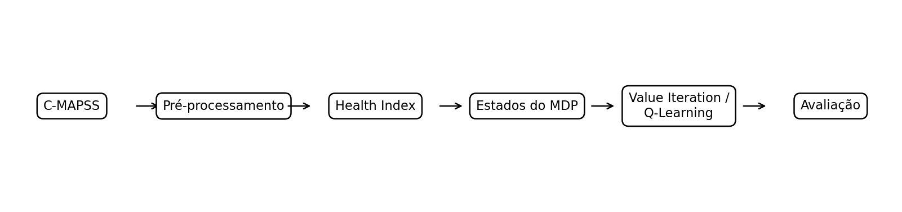
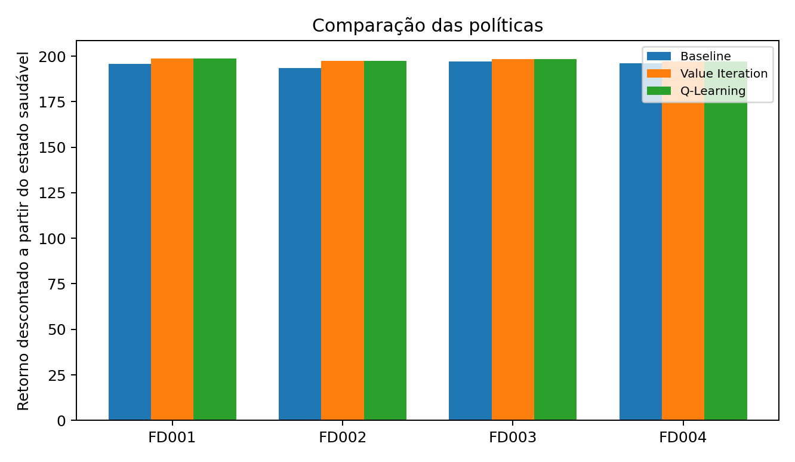
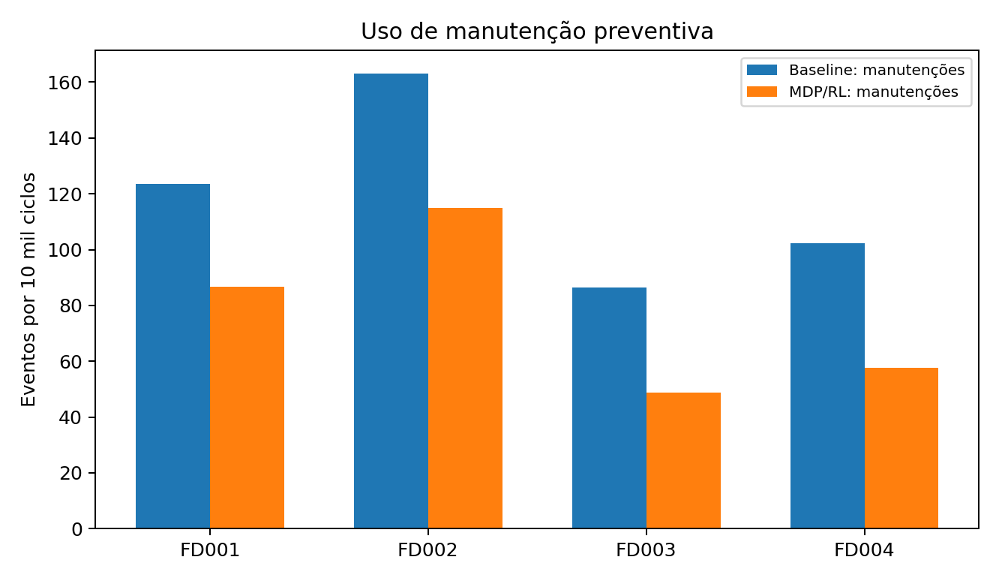
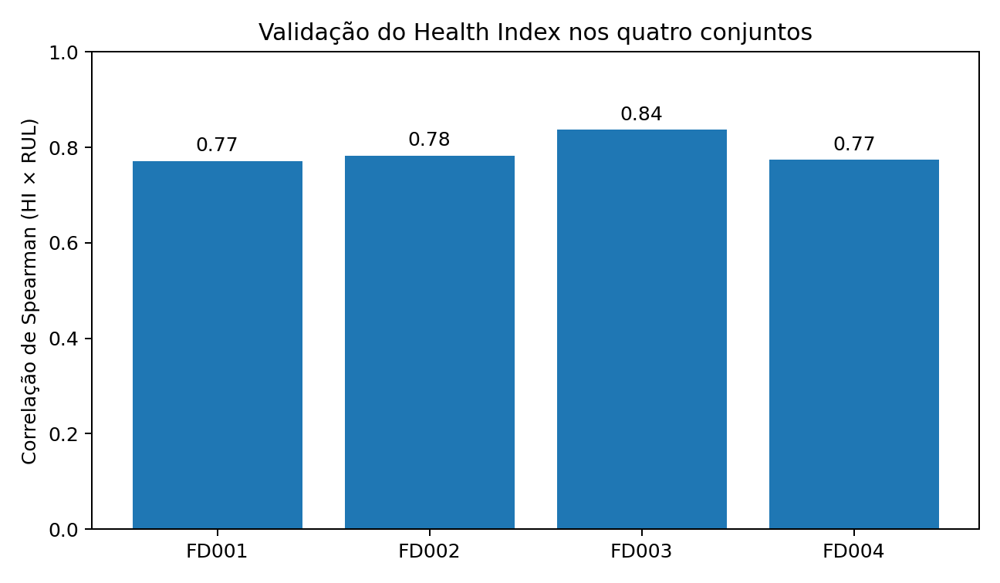

# Intelligent Maintenance with MDP & Reinforcement Learning

<p align="center">
  <b>Degradation-aware maintenance decision-making with NASA C-MAPSS, Markov Decision Processes, Value Iteration and Q-Learning.</b>
</p>

<p align="center">
  Python · Reinforcement Learning · Predictive Maintenance · PCA · MDP · Q-Learning
</p>

> Academic project developed by **Ialisson Roque da Silva** — Electronics Engineering, UFRPE/UACSA (2026).

## Why this project?

Maintenance is a sequential decision problem: operating longer preserves production now, but increases future degradation risk; intervening earlier reduces risk, but introduces maintenance cost and downtime.

This project turns multivariate degradation signals into an explicit decision pipeline:

**Sensors → Health Index → degradation states → MDP → maintenance action**

The objective is not simply to predict failure, but to use the available degradation information to decide **what to do before failure**.

<p align="center">
  
</p>

## Key results

Value Iteration and Q-Learning converged to the same operational policy in the base scenario:

| Equipment state | Learned action |
|---|---|
| Healthy | Operate |
| Moderate degradation | Operate |
| Severe degradation | Operate |
| Critical degradation | Maintenance |

The rule-based baseline is more conservative and performs maintenance from the severe state onward. The reduced-load action was available to the agent but was not selected under the base utility assumptions.

### Discounted return

| Dataset | Baseline | Value Iteration | Q-Learning | Improvement vs. baseline |
|---|---:|---:|---:|---:|
| FD001 | 195.88 | **198.57** | **198.57** | +1.37% |
| FD002 | 193.51 | **197.52** | **197.52** | +2.07% |
| FD003 | 197.02 | **198.25** | **198.25** | +0.63% |
| FD004 | 196.22 | **197.11** | **197.11** | +0.45% |

<p align="center">
  
</p>

The optimized policies improve the modeled discounted objective in all four subsets. The gains are modest and depend on the assumptions of the experimental environment.

### Maintenance vs. failure trade-off

A higher modeled return does **not** automatically mean greater operational safety.

In the FD004 long-run simulation, the baseline produced about **102.2 maintenance actions per 10,000 steps**, while the MDP/RL policy produced about **57.6 maintenance actions** and **18.8 failures per 10,000 steps**. The learned policy therefore reduces planned interventions while accepting greater failure exposure under the chosen utility function.

<p align="center">
  
</p>

## Research V2: robustness and validation

The original experiment has been extended with a dedicated robustness study:

- **5-fold engine-level held-out validation**;
- **4,000 engine-bootstrap transition models** (1,000 per subset);
- **900 reward/action-effect sensitivity configurations**;
- preprocessing **ablation study**;
- **state-threshold sensitivity**;
- PCA vs. an alternative Health Index construction;
- **20 Q-Learning seeds per subset**;
- additional rule-based baselines;
- stress scenarios and an explicit test of the monotonic-transition assumption.

Key robustness result: the Value Iteration base policy remained unchanged in **100% of the 4,000 transition bootstraps**. In held-out engines, mean HI–RUL Spearman remained approximately **0.78, 0.78, 0.84 and 0.78** for FD001–FD004.

Q-Learning matched the VI policy in **100%, 100%, 85% and 75%** of the 20-seed robustness runs respectively, revealing greater learning sensitivity in FD003/FD004.

See the complete analysis in [Research V2 — Robustness and Validation](docs/RESEARCH_V2.md) and the compact [robustness summary](results/research_v2/robustness_summary.csv).

## Methodology

The workflow consists of:

1. Loading FD001–FD004 training/test trajectories.
2. Computing training RUL as distance to the final observed cycle.
3. Normalizing sensors according to operating conditions.
4. Ranking sensors by absolute Spearman association with RUL.
5. Selecting the 10 most informative sensors.
6. Applying PCA to construct a one-dimensional **Health Index**.
7. Discretizing the Health Index into degradation states.
8. Estimating natural transition probabilities from consecutive states.
9. Building the maintenance MDP.
10. Comparing a rule-based baseline, Value Iteration and Q-Learning.

### Health Index

After operating-regime normalization, the Health Index showed a strong monotonic association with RUL:

| Dataset | Spearman HI × RUL | PC1 explained variance |
|---|---:|---:|
| FD001 | ~0.77 | ~0.75 |
| FD002 | ~0.78 | ~0.57 |
| FD003 | ~0.84 | ~0.63 |
| FD004 | ~0.77 | ~0.58 |

<p align="center">
  
</p>

RUL is used during preparation and validation of the indicator. The decision agent does **not** receive the true RUL as its state.

## MDP formulation

### States

| State | Interpretation |
|---|---|
| S0 | Healthy |
| S1 | Moderate degradation |
| S2 | Severe degradation |
| S3 | Critical degradation |
| S4 | Failure |

### Actions

`operate` · `reduced_load` · `maintenance`

### Base experimental utilities

| Event / action | Utility |
|---|---:|
| Operate | +10 |
| Reduced load | +6 |
| Preventive maintenance | -25 |
| Failure / corrective repair | -100 |

The base discount factor is **γ = 0.95**.

These are experimental utility units — **not monetary values and not values supplied by NASA**.

## Dataset

This project uses the four NASA C-MAPSS subsets (FD001–FD004).

**Important:** C-MAPSS is a **simulated turbofan degradation dataset**, not a physical production-line dataset. Here, its trajectories are used as an empirical source for the natural deterioration dynamics of an abstract production-equipment maintenance environment.

C-MAPSS does not contain historical maintenance decisions. Therefore, maintenance actions, action effects and utilities are explicit modeling assumptions.

Raw C-MAPSS files are intentionally not redistributed in this repository. See [`data/README.md`](data/README.md).

## Quick start

Clone the repository and install the dependencies:

```bash
git clone https://github.com/Ialisson/intelligent-maintenance-mdp.git
cd intelligent-maintenance-mdp

python -m venv .venv
pip install -r requirements.txt
```

Place the C-MAPSS files in the data directory (or configure the path in the notebook), then open:

```bash
jupyter notebook notebooks/mdp_cmapss_analysis.ipynb
```

The standalone Python pipeline is available at [`src/projeto_mdp.py`](src/projeto_mdp.py).

### Google Colab

If the data are stored in Google Drive:

```python
from google.colab import drive
from pathlib import Path

drive.mount("/content/drive")
DATA_DIR = Path("/content/drive/MyDrive/Colab Notebooks/Projeto")
```

Then run the notebook from top to bottom.

## Repository structure

```text
intelligent-maintenance-mdp/
├── README.md
├── LICENSE
├── requirements.txt
├── data/
│   └── README.md
├── notebooks/
│   └── mdp_cmapss_analysis.ipynb
├── src/
│   └── projeto_mdp.py
├── results/
│   ├── resultados.csv
│   ├── resumo_datasets.csv
│   └── figures/
└── docs/
    ├── technical_report_pt-BR.pdf
    └── RESUMO_PORTFOLIO.md
```

## Reproducibility

The experiments use fixed random seeds where stochastic procedures are involved. Q-Learning uses epsilon-greedy exploration; the base experiment uses **30,000 episodes** with **60 steps per episode**.

## Limitations

- C-MAPSS is simulated.
- The underlying system is a turbofan model, not a production line.
- The dataset does not contain historical maintenance actions.
- Maintenance effects and utilities are modeled assumptions.
- Health Index construction depends on preprocessing and dimensionality-reduction choices.
- Industrial deployment would require recalibration using real costs, constraints, maintenance records and safety requirements.

## Tech stack

**Python · NumPy · Pandas · SciPy · scikit-learn · PCA · K-Means · Matplotlib · MDP · Value Iteration · Q-Learning · Jupyter**

## Documentation

- [Jupyter notebook](notebooks/mdp_cmapss_analysis.ipynb)
- [Python implementation](src/projeto_mdp.py)
- [Technical report — PT-BR](docs/technical_report_pt-BR.pdf)
- [Experimental results](results/resultados.csv)
- [Research V2 — robustness and validation](docs/RESEARCH_V2.md)
- [Research V2 summary](results/research_v2/robustness_summary.csv)

## Author

**Ialisson Roque da Silva**  
Electronics Engineering — UFRPE/UACSA

## License

Source code is released under the [MIT License](LICENSE). Dataset licensing and redistribution terms remain those of the original data provider.
